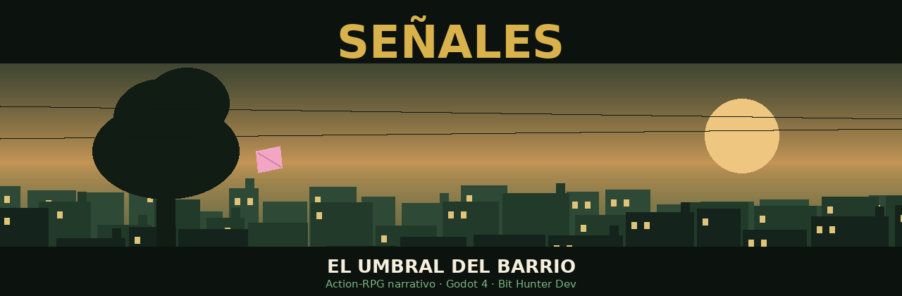

<div align="center">



**Un Action-RPG narrativo sobre escuchar a la gente que está sola.**

[](https://godotengine.org)
[](https://docs.godotengine.org)
[]()
[]()
[]()

</div>

---

## Sobre el juego

Barrio Sauco, febrero, cuarenta grados. **Uma Torres**, 18 años, tiene el día libre y su papá le pide un favor: tres vecinos encontraron objetos raros en sus casas y quiere que pregunte qué pasó.

No hay misterio policial. Hay una señora viuda que no habla con nadie hace tres años, un jubilado que dejó de tocar el bandoneón, y una maestra que sigue yendo a la plaza a las seis de la tarde por costumbre.

Esa misma tarde, el árbol de la Plaza Mayor se cae sin hacer ruido y el cielo se dobla como papel.

Alguien dejó nueve señales para que Uma las encontrara. Una por cada cosa que sabía de ella.

---

## Pilares de diseño

**La empatía es la mecánica, no el tema.** Escuchar no es una escena obligatoria entre combates: es el verbo principal del juego. El sistema de Resonancia es más poderoso que cualquier ataque, y el juego lo demuestra mecánicamente.

**El barrio es un personaje con memoria.** Los NPCs cambian de lugar, de humor y de tema según el acto y según lo que Uma resolvió.

**Nadie es solo una nota.** Cada NPC con nombre quiere dos cosas incompatibles.

**La fantasía amplifica lo real.** El Revés nunca introduce un conflicto nuevo: le da cuerpo físico a uno que ya existía en el barrio.

**La declaración final se gana.** El jugador llega al Mirador sabiendo exactamente cuánto le costó a Pablo subir esa escalera.

---

## Características

| | |
| :---- | :---- |
| **Género** | Action-RPG narrativo 2D top-down |
| **Duración** | 8–11 horas |
| **Estructura** | 5 actos + prólogo · doble hilo narrativo |
| **Clases** | Maga (Tejedora) · Guerrera (Anclada) · Resonante (Cantora) |
| **Mundo** | 7 zonas + dimensión espejo (El Revés) |
| **Finales** | 3, según vínculos y señales encontradas |
| **Combate** | Resonancia (empatía activa) + ARPG en tiempo real |
| **Tono** | Cálido, íntimo, con humor seco. Nunca cínico |

---

## Estado del proyecto

```
[██████████████████████████████] Diseño            100%
[░░░░░░░░░░░░░░░░░░░░░░░░░░░░░░] Vertical slice      0%
[░░░░░░░░░░░░░░░░░░░░░░░░░░░░░░] Arte                0%
[░░░░░░░░░░░░░░░░░░░░░░░░░░░░░░] Audio               0%
```

**Ahora:** estructura del proyecto y sistema de guardado.
**Próximo hito:** `v0.1` — Prólogo jugable.

Ver el [tablero](../../projects) y los [issues abiertos](../../issues).

---

## Documentación

Todo el diseño está en [`docs/`](docs/).

| Documento | Contenido |
| :---- | :---- |
| `SENALES_DOCUMENTO_MAESTRO.docx` | Todo junto — 76 páginas |
| `SENALES_GDD_v3.docx` | Historia, personajes, mundo, sistemas, misiones |
| `SENALES_dialogos_ambientales.docx` | Inspecciones, barks por acto, cierres |
| `SENALES_biblia_arte.docx` | Specs de assets y dirección de arte |
| `SENALES_plan_trabajo.docx` | Ritmo semanal y hoja de ruta |
| `SENALES_guia_git.docx` | Flujo de trabajo y resolución de problemas |

**Material gráfico:** maquetas de mundo, 12 hojas de zona con coordenadas exactas, 5 hojas de interludio y la paleta maestra. Todo generado por script en [`docs/scripts_mapas/`](docs/scripts_mapas/) y regenerable.

---

## Estructura del proyecto

```
senales/
├── addons/          plugins (Dialogue Manager)
├── assets/          sprites, audio, fuentes
├── data/            diálogos y datos del juego
├── docs/            documentación y maquetas
├── scenes/          escenas .tscn
│   ├── characters/  Uma, Pablo, NPCs
│   ├── systems/     cámara, GUI, transiciones
│   ├── ui/          menús, cuaderno, balloon
│   └── world/       las zonas del barrio
└── scripts/         .gd organizados igual que scenes/
```

---

## Desarrollo

```bash
# Clonar
git clone https://github.com/Rick-hunterr/signs.git
cd signs

# Abrir con Godot 4.x
godot project.godot
```

**Ramas:** `main` (versiones estables) · `dev` (trabajo diario) · `feature/*` · `fix/*`

**Commits:** formato Conventional Commits en español.

```
feat(uma): movimiento tile a tile con bump al chocar
art(tiles): tileset de interiores, 20 tiles base
fix(camara): temblor por subpíxeles al moverse
```

---

## Créditos

**Diseño, código y arte:** Bit Hunter Dev

Hecho en Córdoba, Argentina.

---

<div align="center">

*"Siempre te fijás en lo que los demás no ven."*

</div>
